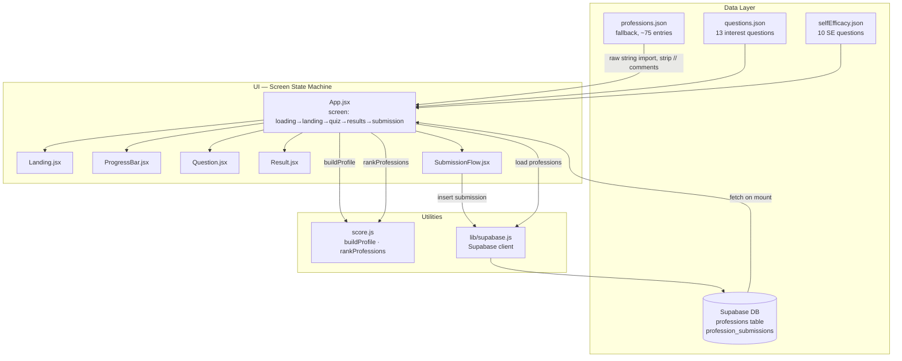

# Job Akinator — Architecture

## Project Goals

A career-matching quiz that maps a user's interests and self-assessed strengths to a curated list of ~75 professions. The quiz runs in two parts: 13 interest questions (multiple choice) followed by 10 self-efficacy questions (Likert confidence scale). Results are ranked by cosine similarity between the user's trait vector and each profession's trait vector. Users who don't recognise themselves in the top three matches can suggest a missing profession, which is saved to a shared database.

The project is a personal tool, hosted on GitHub Pages, backed by Supabase for live profession data and submissions.

---

## Architecture Overview



---

## Key Architectural Decisions

### 1. Screen state machine (no router)

`App.jsx` holds a single `screen` state (`loading | landing | quiz | results | submission`) and renders the matching component. There are only five screens, and navigation is always linear — no back-stack, no deep-linking needed. A router would add overhead with no benefit here.

**Tradeoff**: URL does not reflect screen position; browser back button does nothing. Acceptable for a single-page quiz tool.

### 2. Two-section quiz modelled as a single state machine

The quiz has two sections: `interest` (13 questions) and `se` (10 questions). Rather than two separate flows, both share the same `currentQ` counter and `handleAnswer` dispatcher in App.jsx, with a `quizSection` state switching between them. An 80 ms transition flag provides a fade between questions and between sections.

SE questions are stored as `{ id, text, trait }` in `selfEfficacy.json` and expanded to the standard `{ answers: [{text, deltas}] }` shape at module load time using a fixed three-point `SE_SCALE`. This means `Question.jsx` renders both section types without modification.

### 3. Trait vector + cosine similarity matching

Each profession and each user is represented as a 10-dimensional vector of named traits:

```
analytical · creative · social · technical · physical
entrepreneurial · structured · humanitarian · outdoors · leadership
```

**Scoring (`buildProfile`)**:
- Interest answers accumulate raw delta scores per trait
- SE answers contribute a 0/1/2 score for a single trait each
- Interest scores are normalised by the observed max (so the strongest trait maps to 1.0)
- SE scores are normalised by a fixed max of 2
- Final trait value: `interest × 0.65 + SE × 0.35`

**Matching (`rankProfessions`)**:
- Cosine similarity between user profile vector and each profession's trait vector
- Returns percentage (0–100); top 3 are displayed

**Tradeoffs**:
- Cosine similarity is direction-aware, not magnitude-aware — a user weak across the board but proportionally similar will score well against a high-trait profession. This is intentional: the quiz measures *what* someone is like, not *how much*.
- Normalising interest by observed max means one strong preference pulls down all relative scores; a user who answers neutrally throughout will have a flat profile.

### 4. Profession data: Supabase primary, local JSON fallback

On mount, App.jsx fetches professions from Supabase (`status = 'active'`). If that fails or returns empty, it falls back to the bundled `professions.json`. This means the app works offline and never shows a broken state.

Supabase rows use `name` instead of `title`; App.jsx normalises this on load: `{ ...p, title: p.name }`.

**professions.json note**: the file contains a large commented-out block (lines 1–602) — an earlier draft of the profession list. Vite's JSON plugin cannot parse comment-prefixed JSON, so the file is imported with `?raw` and comment lines are stripped before `JSON.parse`. The comments are intentionally preserved in the file.

### 5. Crowd-sourced submission flow

When a user picks "None of these fit me", the `SubmissionFlow` component collects:
1. A free-text job title
2. A 10-slider trait profile (pre-populated from their quiz result, adjustable)
3. A confirmation step with a bar chart preview

The submission is inserted into `profession_submissions` in Supabase, tagged with a session ID from `localStorage`. The intent (stated in the UI) is that if multiple users describe the same role similarly, it may be added to the profession pool.

### 6. No state management library

All state lives in `App.jsx` and is passed as props. The app has one data-flow path (quiz → results → optional submission) with no cross-component communication beyond callbacks. Context or a store would be premature here.

### 7. Styling: Tailwind utilities + inline style tokens

Layout and spacing use Tailwind CSS v4 utilities. Colours and sizing that form the design language (e.g. `#5B5BD6`, `#1A1A1A`, `44px` button height) are applied as inline styles rather than being hoisted into a Tailwind theme config. This keeps the design constants visible at the point of use, which suits a small project with one developer.

---

## File Map

```
src/
  App.jsx                  Screen state machine; quiz orchestration; data loading
  main.jsx                 React root mount

  components/
    Landing.jsx            Start screen
    ProgressBar.jsx        Top bar with section label + count (Part 1/2)
    Question.jsx           Renders one question with animated answer selection
    Result.jsx             Top-3 profession cards with match bars and expandable detail
    SubmissionFlow.jsx     3-step form for suggesting a missing profession
    Results.jsx            (unused — superseded by Result.jsx)

  data/
    questions.json         13 interest MC questions with per-answer trait deltas
    selfEfficacy.json      10 SE questions (one per trait), ids 101–110
    professions.json       ~75 professions with trait vectors; first 602 lines are
                           commented-out draft entries retained for reference

  utils/
    score.js               TRAITS list; buildProfile; rankProfessions; cosine helpers

  lib/
    supabase.js            Supabase client initialised from VITE_ env vars

scripts/
  seed.js                  Node script: reads professions.json, upserts to Supabase
  schema.sql               Supabase table definitions
```

---

## Libraries

| Library | Why |
|---|---|
| React 19 | UI rendering |
| Vite 8 | Build tool; `?raw` import used to bypass JSON plugin for comment-containing file |
| Tailwind CSS v4 | Layout utilities via `@tailwindcss/vite` plugin |
| @supabase/supabase-js v2 | Fetching live profession data; inserting submissions |
| gh-pages | One-command deployment to GitHub Pages |

---

## Deployment

- `vite.config.js` sets `base: '/jobakinator/'` for GitHub Pages sub-path
- `package.json` homepage: `https://mochmouri.github.io/jobakinator`
- `npm run deploy` → runs `vite build` then `gh-pages -d dist`
- Env vars (`VITE_SUPABASE_URL`, `VITE_SUPABASE_ANON_KEY`) must be set at build time or the Supabase client will silently fail and the fallback JSON will be used

---

## Unclear Intent / Loose Ends

- **`Results.jsx`** (capital R) exists alongside `Result.jsx` but is never imported. Likely a superseded draft — safe to delete.
- **`seed.js`** reads `professions.json` directly via Node `fs`, which means it will fail if the comment block causes a JSON parse error. The script would need the same comment-stripping logic as the `?raw` import.
- **Landing text** says "16 questions" but the actual count is 23 (13 interest + 10 SE). The copy predates the two-section redesign and is stale.
- **`hero.png`** is in `src/assets` but is not referenced anywhere in the current code.
